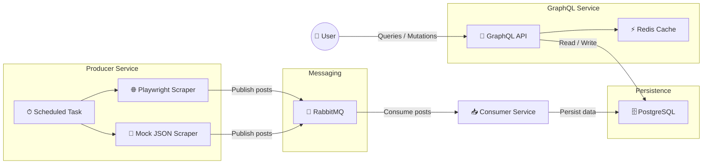

# 📰 News Microservices Platform

This project is a **microservices-based news aggregation platform** built with **Spring Boot**, **Docker**, and **GraphQL**. It demonstrates event-driven architecture using **RabbitMQ**, persistent storage with **PostgreSQL**, caching with **Redis**, and web scraping using **Playwright**.

It demonstrates:
- ⏱ **Scheduled web scraping** (Playwright / Mock)
- 📨 **Event-driven architecture** using RabbitMQ
- 🗄 **Persistent storage** with PostgreSQL
- ⚡ **Redis caching** for GraphQL queries
- 🔐 **OAuth2 JWT security** (Google)

---

## 🏗 Architecture Overview


### Services

| Service    | Description |
|------------|------------|
| **Producer** 🕷 | Periodically scrapes news articles (scheduled task) and publishes events to RabbitMQ |
| **Consumer** 📥 | Consumes events and persists posts to PostgreSQL |
| **GraphQL API** 🚀 | Exposes query & mutation API, applies Redis caching |
| **RabbitMQ** 📨 | Message broker |
| **PostgreSQL** 🐘 | Relational database |
| **Redis** ⚡ | Caching layer for frequently accessed GraphQL queries |

---

## 🧰 Tech Stack

- Java 20
- Spring Boot 3
- Spring Security (OAuth2 Resource Server)
- GraphQL
- RabbitMQ
- PostgreSQL
- Redis
- Docker & Docker Compose
- Playwright
- Testcontainers
- Maven

---

## ✅ Prerequisites

- **Docker Desktop**
- **Docker Compose**
- **Java 20+** (only required to build JARs)

---

## ⚙️ Configuration

### Scraper Type

The `SCRAPER_TYPE` environment variable controls how news is fetched:

| Value | Description                                                                                                           |
|------|-----------------------------------------------------------------------------------------------------------------------|
| `playwright` | Scrapes real news website                                                                                             |
| `mock` | Loads test data from local JSON file (useful when external sources are unavailable) |

Default value: `playwright`

Example:
```yaml
environment:
  - SCRAPER_TYPE=playwright
```

---

## ▶ Running the Project

### 1️⃣ Build JAR files 
```shell
cd producer
./mvnw clean package -DskipTests
cd ../consumer
./mvnw clean package -DskipTests
cd ../graphql
./mvnw clean package -DskipTests
```
💡 If ```JAVA_HOME``` **is not set**, you can temporarily set it for the current session (Windows PowerShell):
```shell
$env:JAVA_HOME="C:\Path\To\JDK"
```

### 2️⃣ Build Docker images
```shell
docker-compose build
```
### 3️⃣ Start all services
```shell
docker-compose up
```
### 4️⃣ Stop services
```shell
docker-compose down
```

---

## 🚀 GraphQL API

### Endpoint
```
http://localhost:8080/graphql
```

### Available Queries
Get all posts
```
query {
  getPosts {
    id
    title
    summary
    date
    imageSrc
    likes
    dislikes
    categories { id title }
    comments { id text }
  }
}
```
Get one post by id
```
query {
  getPost(id: "1") {
    title
    comments { text }
  }
}
```

### Available Mutations
➕ Add categories to posts
```
mutation {
  addCategory(
    id: "1"
    title: "Technology"
  ) {
    id
    title
    categories {
      id
      title
    }
  }
}
```
💬 Add comments
```
mutation {
  addComment(id: "1", text: "Great article!") {
    id
    comments { text }
  }
}
```
👍 Like / 👎 Dislike posts
```
mutation {
  like(id: "1", value: true) {
    id
    likes
    dislikes
  }
}
```

### 📚 New to GraphQL?
Check out official docs: https://graphql.org/learn/

---

## 🔐 Authentication

The GraphQL API is secured using OAuth2 JWT (Google issuer).
### How authentication works
- Clients must send a JWT token:
```Authorization: Bearer <JWT_TOKEN>```
- Tokens can be obtained via Google OAuth
- Users are automatically registered on first successful authentication

### Helpful resources
- 📘 Google OAuth overview 
  https://developers.google.com/identity/protocols/oauth2
- 🛠 Creating OAuth Web Client
  https://console.cloud.google.com/apis/credentials
- 🔄 OAuth flow explanation
  https://developers.google.com/identity/openid-connect/openid-connect
> ⚠️ When testing with Postman, your email must be added as a test user in the Google OAuth consent screen.

---

## 🧪 Integration Tests

- Uses Testcontainers
- Requires Docker to be running
- On Windows, Docker Desktop must be started before running tests

```shell
./mvnw verify
```

---

## ✨ Future Improvements

- 🖥 Web & Mobile User Interfaces
- 🗄 Database Migrations as a Dedicated Service
- ⚙️ Continuous Integration (CI)

---

## 📄 License
This project is licensed under the MIT License.